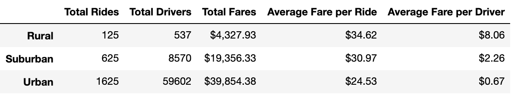

# Pyber Analysis

## Overview of Project
In this project, I served as a Data Analyst for PyBer and was tasked with analyzing large datasets and creating visualizations to display the differences in ride-sharing data between Urban, Suburban, and Rural cities. To complete the new analysis, I was given the following tasks:
- Create a summary DataFrame of the ride-sharing data by city type
- Create a multiple-line graph that shows the total weekly fares for each city type using Pandas and Matplotlib

## Results
Total Rides
- Urban cities have significantly more rides than Rural and Suburban cities, with 1,625 out of total 2,375. Rural and Suburban cities had 125 and 625 rides, respectively. A breakdown of the total rides between the cities is shown in the pie chart below.
- 

Total Drivers
- Urban cities also had significantly more drivers than the other two city types, with 59,602 out of total 68,709. Rural and Suburban cities have 537 and 8570 total drivers, respectively. A full breakdown of the total drivers for each city is shown in the pie chart below.
- 

Total Fares
- Urban cities have the highest in total fare, with $39,854.38, which is expected as there were significantly more rides in Urban cities, which would lead to more money in fares. Rural and Suburban cities had total fares of $4,327.93 and $19,356.33, respectively. A breakdown of the total fares are shown in the pie chart below.
- 

Average Fare per Ride
- The average fare per ride for Rural, Suburban, and Urban cities are $34.62, $30.97, and $24.53, respectively. Rural cities have the highest fare per ride, while Urban cities have the lowest, even though the total fares were higher for Urban cities. 

Average Fare per Driver
- The average fare per driver for Rural, Suburban, and Urban cities are $8.06, $2.26, and $0.67, respectively. Although Urban cities have the highest fares and number of drivers, the fare per driver is the lowest by far. 

A full breakdown of the discussed metrics is shown in the table below:

## Summary
Based on the results, my recommendations to the CEO regarding disparities among the city types are:
1. Ride-sharing seems to be the most popular in Urban cities, based on the number of rides and drivers. However, the average fare per driver of $0.67 is extremely low, so PyBer should make some changes in its business model to generate more profit with Urban cities. 
2. The average fare per ride is the lowest in Urban cities, the most popular city type for ride-sharing, and is higher for Suburban and Rural cities where ride-sharing is not as popular. To attract more customers in Rural and Suburban cities, I would recommend lowering the fare. The increase in customers will hopefully in turn generate more revenue to make up for the initial decrease when prices are lowered. 
3. Focus on growing PyBer's presence in Rural and Suburban cities. Since PyBer seems to be doing extremely well in Urban cities, try to mimic the business practices in the other city types as well. To do this, start with trying to find more drivers in the other city types, as more available drivers will hopefully increase the number of customers and rides.
