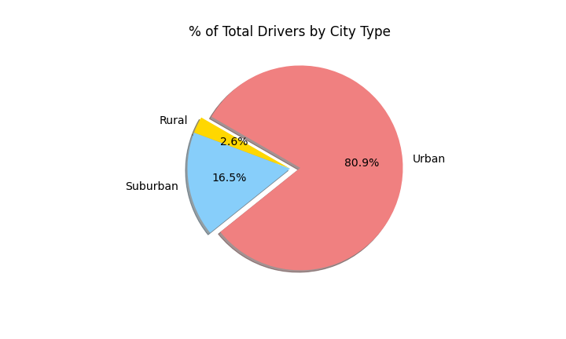

# Pyber Analysis

## Overview of Project
In this project, I served as a Data Analyst for PyBer and was tasked with analyzing large datasets and creating visualizations to display the differences in ride-sharing data between Urban, Suburban, and Rural cities. To complete the new analysis, I was given the following tasks:
- Create a summary DataFrame of the ride-sharing data by city type
- Create a multiple-line graph that shows the total weekly fares for each city type using Pandas and Matplotlib

## Results
Total Rides
- Urban cities have significantly more rides than Rural and Suburban cities, with 1,625 out of total 2,375. Rural and Suburban cities had 125 and 625 rides, respectively. A breakdown of the total rides between the cities is shown in the pie chart below.
- 

Total Drivers
- Urban cities also had significantly more drivers than the other two city types, with 59,602 out of total 68,709. Rural and Suburban cities have 537 and 8570 total drivers, respectively. A full breakdown of the total drivers for each city is shown in the pie chart below.
- 

Total Fares
- Urban cities have the highest in total fare, with $39,854.38, which is expected as there were significantly more rides in Urban cities, which would lead to more money in fares. Rural and Suburban cities had total fares of $4,327.93 and $19,356.33, respectively. A breakdown of the total fares are shown in the pie chart below.
- 

Average Fare per Ride
- The average fare per ride for Rural, Suburban, and Urban cities are $34.62, $30.97, and $24.53, respectively. Rural cities have the highest fare per ride, while Urban cities have the lowest, even though the total fares were higher for Urban cities. 

Average Fare per Driver
- The average fare per driver for Rural, Suburban, and Urban cities are $8.06, $2.26, and $0.67, respectively. Although Urban cities have the highest fares and number of drivers, the fare per driver is the lowest by far. 

A full breakdown of the discussed metrics is shown in the table below:
-

## Summary
Based on the results, provide three business recommendations to the CEO for addressing any disparities among the city types
